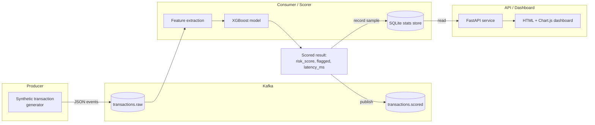

# Real-Time Transaction Risk Scoring Pipeline

An event-driven pipeline that scores synthetic payment transactions for fraud/risk **in real time** as they stream through Kafka, instead of in an offline batch job hours later. Built as a portfolio project to demonstrate the kind of architecture used in production fintech risk systems. This repo is an original, from-scratch implementation on entirely synthetic data, and is **not** connected to, and does not reproduce, any employer's proprietary system, data, or metrics.

## The problem

Card-not-present and account-takeover fraud has to be caught at authorization time (a few hundred milliseconds) or the transaction has already gone through. A model that scores yesterday's transactions in a nightly Spark job is useless for stopping fraud *during checkout*. That constraint shapes the whole design here:

- Transactions arrive continuously and must be scored **one at a time, as they land**, not in a batch window.
- Scoring latency (feature extraction + model inference) has to be small and predictable: this repo measures and reports it, rather than assuming it away.
- Operators need live visibility into throughput, score distribution, and flag rate. A log file isn't enough; they need a dashboard that updates as the stream flows.

## Architecture



1. **`app/producer.py`** generates synthetic transactions (amount, merchant category, device/location signals, velocity, etc.) with a shared generator (`app/generator.py`) and publishes them as JSON to the `transactions.raw` Kafka topic at a configurable rate.
2. **`app/consumer.py`** subscribes to `transactions.raw`, turns each raw event into a feature vector (`app/features.py`), scores it with a trained XGBoost model (`app/scoring.py`), measures per-message latency, publishes the scored result to `transactions.scored`, and records a rolling sample (latency, score, flagged) into a small SQLite store.
3. **`app/api.py`** is a FastAPI service that reads from that same SQLite store and exposes `/health`, `/stats` (throughput, latency percentiles, flag rate, score histogram), and `/dashboard` (a single-file HTML page that polls `/stats` every 2 seconds and renders live charts with Chart.js). The API never talks to Kafka directly, so it can run, and be tested, completely independently of the broker.

## Stack

Python 3.11+, `confluent-kafka` (Kafka client), FastAPI, XGBoost + scikit-learn, SQLite (rolling stats store), pytest. Kafka runs in **KRaft mode** (no ZooKeeper) via `docker-compose.yml`.

## Project layout

```
app/
  features.py    transaction schema + pure raw-dict -> feature-vector transform
  generator.py   shared synthetic transaction generator (used by producer & training)
  models.py      pydantic response models
  scoring.py     RiskScorer (model inference) + stats aggregation math + SQLite StatsStore
  producer.py    Kafka producer: streams synthetic transactions
  consumer.py    Kafka consumer: scores + publishes + records stats
  api.py         FastAPI app: /health, /stats, /dashboard
training/
  train_model.py generates a synthetic labeled dataset, trains XGBoost, evaluates, saves model.pkl + metrics.json
  model.pkl      committed trained model (small, portable; see "Training" below)
  metrics.json   metrics from the most recent training run, in this repo
tests/           pytest suite (no live Kafka broker required)
docker-compose.yml, Dockerfile.producer, Dockerfile.consumer, Dockerfile.api
```

## Running it locally with Docker Compose

Brings up a single-node Kafka broker (KRaft mode), a topic-creation init job, and the producer/consumer/API services, all built from this repo:

```bash
docker compose up --build
```

Then visit:
- `http://localhost:8000/dashboard`: live charts
- `http://localhost:8000/stats`: raw JSON stats
- `http://localhost:8000/health`: liveness + model version

Tear down with `docker compose down` (add `-v` to also drop the stats volume).

The consumer and API containers mount `./training` read-only, so retraining the model locally (see below) and restarting the containers picks up the new `model.pkl` without rebuilding the image.

## Running it without Docker

```bash
python3 -m venv .venv
.venv/bin/pip install -r requirements.txt

# Train the model (also runs automatically if you skip this, since model.pkl is
# already committed to the repo)
.venv/bin/python -m training.train_model

# In separate terminals, against a Kafka broker at localhost:9092:
.venv/bin/python -m app.producer --rate 10
.venv/bin/python -m app.consumer
.venv/bin/python -m uvicorn app.api:app --reload
```

If you don't have a Kafka broker handy, `docker compose up kafka kafka-init` starts just the broker and topic setup, and you can run the three Python services natively against `localhost:9092` (the compose file also maps a `PLAINTEXT_HOST://localhost:29092` listener for this).

## Training

`training/train_model.py` generates a synthetic labeled dataset with a hand-crafted generator (`app/generator.py`) shaped like real transaction data (customer spending profiles, merchant categories, device/location signals) rather than an unstructured `make_classification` blob. Legitimate and fraud-labeled transactions are drawn from deliberately overlapping distributions (plus a small amount of injected label noise, simulating imperfect ground truth), so the classification problem isn't trivially separable.

```bash
.venv/bin/python -m training.train_model
```

This prints metrics and writes `training/model.pkl` (joblib bundle: model + feature schema + version) and `training/metrics.json`.

### Measured model metrics

From `training/metrics.json`, measured on a held-out 20% split (12,000 of 60,000 synthetic transactions) of **this repo's synthetic dataset**, not production traffic:

| Metric | Value |
|---|---|
| Precision | 0.699 |
| Recall | 0.728 |
| F1 | 0.713 |
| ROC AUC | 0.876 |
| PR AUC | 0.755 |

The model was deliberately trained against a noisy, overlapping synthetic distribution (see `app/generator.py`) rather than a cleanly separable one, so these numbers look like a real (if modest-scale) fraud model rather than a suspiciously perfect 1.0 AUC.

## Performance benchmark (local, synthetic, not a production claim)

Feature extraction + model inference latency and throughput, measured single-process on the developer machine used to build this repo (5,000 synthetic transactions, after a 200-event warmup, no Kafka network hop included):

| Metric | Value |
|---|---|
| Throughput (score calls/sec, single process) | ~3,500 /sec |
| Scoring latency p50 | ~0.22 ms |
| Scoring latency p95 | ~0.36 ms |
| Scoring latency p99 | ~0.71 ms |

These numbers cover **feature extraction + `model.predict_proba`** only. They do not include Kafka produce/consume network latency, which adds its own (typically low single-digit millisecond, for a local broker) overhead on top. End-to-end throughput in `docker-compose` is also bounded by the `--rate` flag passed to the producer, since it's a simulator, not a load generator. Treat these as an architecture demonstration and a lower bound on scoring-path latency, not a production SLA.

## Tests

```bash
.venv/bin/pip install -r requirements.txt
.venv/bin/python -m pytest -q
```

The suite (37 tests) covers:
- `app/features.py` transform correctness (shape, one-hot encoding, ratio math, missing-field validation)
- `app/scoring.py`: loading the committed model and scoring known feature vectors into `[0, 1]`, plus the stats aggregation math (percentiles, flag rate, histogram bucketing) against hand-computed expected values
- the `StatsStore` rolling-window SQLite logic (recording, windowing, pruning)
- `app/consumer.py`'s pure scoring/result-building function
- the FastAPI `/health`, `/stats`, and `/dashboard` endpoints via `TestClient`

None of the tests require a live Kafka broker: Kafka clients are only ever constructed inside `producer.py`'s and `consumer.py`'s `run()` entry points, never at import time, and are exercised through mocked/pure helper functions in tests instead.

## Design notes

- **Train/serve skew avoidance**: `app/features.py`'s `transform_to_feature_vector` is a pure function with no dependencies on Kafka, FastAPI, or the model. It's the single code path imported by both `training/train_model.py` (offline) and `app/consumer.py` (online), so the feature computation can never drift between training and serving.
- **Shared data generator**: `app/generator.py` is imported by both the producer and the training script, so the live "production" stream and the offline training distribution match by construction.
- **API/Kafka decoupling**: `app/api.py` never imports a Kafka client. It only reads the model file and the SQLite stats store the consumer writes to, so it can start, run, and be tested with no broker at all, which is useful both for the test suite and for `docker-compose` bring-up ordering.
- **SQLite WAL mode**: the stats store turns on `PRAGMA journal_mode=WAL` for file-backed databases so the consumer (writer) and API (reader) processes can share one SQLite file concurrently under `docker-compose` without lock contention.

## License

MIT. See [LICENSE](LICENSE).
